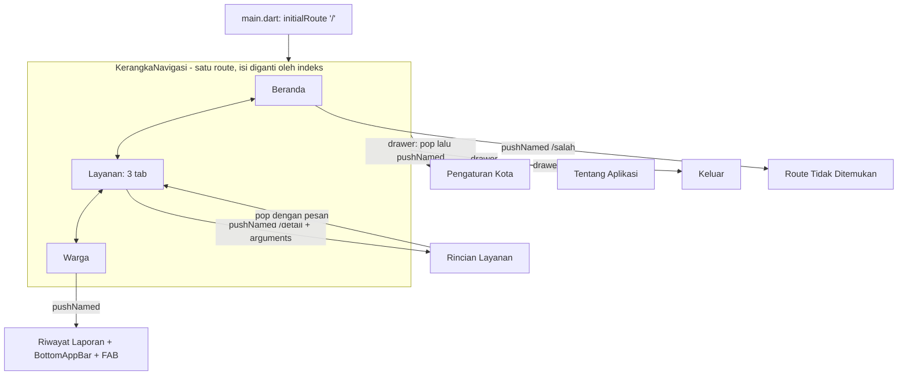

# Catatan Laporan Soal 1 - Nusantara Cerdas Mobile

## Alur navigasi

Hanya mengganti isi (tanpa menambah tumpukan route): Beranda, Layanan, Warga
(NavigationBar / NavigationRail / NavigationDrawer), serta tiga tab pada Layanan.

Menambah tumpukan route: Rincian Layanan, Riwayat Laporan, Pengaturan Kota,
Tentang Aplikasi, Keluar, Route Tidak Ditemukan.

## Alasan pemilihan (untuk laporan)

- NavigationBar: tiga tujuan utama harus selalu terlihat dan saling
  menggantikan isi layar, tanpa menambah tumpukan route.
- NavigationDrawer: Pengaturan Kota, Tentang Aplikasi, dan Keluar jarang dibuka,
  jadi diletakkan di panel samping agar bagian bawah tidak penuh.
- Tab navigation: Perizinan, Kesehatan, dan Transportasi setara dan berada di
  satu halaman Layanan, sehingga cukup digeser tanpa meninggalkan halaman.
- Named route: seluruh halaman didaftarkan di app_routes.dart, nama route
  disimpan sebagai konstanta, dan route salah ditangani onUnknownRoute.

## Yang perlu dilakukan sendiri
Nama proyek, repo Git (commit bertahap), tangkapan layar (sempit & lebar, Chrome),
dan laporan PDF Modul2_NIM_NamaLengkap.pdf.
